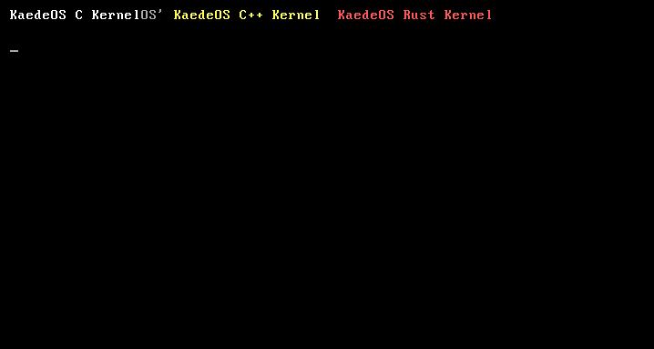

# KaedeOS

**KaedeOS** is my educational 64-bit operating system written from scratch.  
The project is created for a deep understanding of computer operation: from booting to memory management and I/O devices.  
Currently the kernel can boot via GRUB, switch to long mode, and handle CPU exceptions via an Interrupt Descriptor Table (IDT).

## Screenshot



## Project Structure

```
KaedeOS/
├── bootloader/
│   ├── boot.asm
│   └── multiboot_header.asm
├── drivers/
│   └── vga.c
├── kernel/
│   ├── kernel.c
│   ├── kernel.cpp
│   ├── kernel.rs
│   ├── interrupts.c
│   └── isr.asm
├── libc/
│   └── string.c
├── utils/
│   └── ports.c
├── .gitignore
├── LICENSE
├── Makefile
├── README.md
├── ROADMAP.md
├── CHANGELOG.md
└── linker.ld
```

## Current Features

- Booting with a Multiboot2 header (GRUB support)
- CPUID check and long mode support verification
- Page table setup and transition to 64-bit mode
- Three independent entry points in C, C++, and Rust — each outputs its own string to VGA with a unique color
- Basic VGA driver (text output with position and color)
- I/O utilities: `inb`/`outb`, `strlen`
- **Interrupt Descriptor Table (IDT) initialized with 256 ISR stubs**:
  - Correctly handles error codes (pushes dummy `0` when necessary)
  - Saves and restores full CPU context across interrupts
  - Successfully catches CPU exceptions (e.g., Divide Error `#DE`) and prints a message to the VGA screen via a C handler

### Requirements

- `make`
- `nasm` ≥ 2.14
- `x86_64-elf-gcc`, `x86_64-elf-g++`
- `rustc` with target `x86_64-unknown-none`
- `grub-mkrescue` and `xorriso`

### Build and Run

```bash
make          # build the ISO image (build/kaedeos.iso)
make run      # run in QEMU (options: -m 512M -smp 2)
make clean    # clean temporary files
```

> **View the Project Roadmap:** [ROADMAP.md](ROADMAP.md)