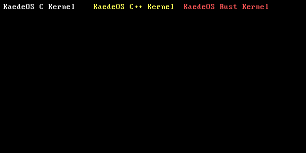
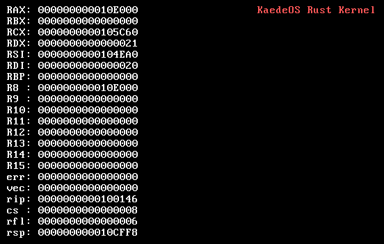

# KaedeOS

**KaedeOS** is my educational 64‑bit operating system written from scratch.  
The project is created for a deep understanding of computer operation: from booting to memory management and I/O devices.  
Currently the kernel can boot via GRUB, switch to long mode, handle CPU exceptions, and run a programmable interval timer with a second counter.

## Screenshots

  
*C (white), C++ (yellow), and Rust (red) entry points – each prints its own message with a distinct colour.*

  
*PIT timer running: seconds counter displayed on VGA (0x0F white on black).*

  
*Divide-by-zero exception (#DE) caught – full register dump printed to VGA.*

## Project Structure

```
KaedeOS/
├── bootloader/
│   ├── boot.asm
│   └── multiboot_header.asm
├── drivers/
│   ├── vga.c
│   └── pit.c
├── kernel/
│   ├── kernel.c
│   ├── kernel.cpp
│   ├── kernel.rs
│   ├── isr.asm
│   ├── idt.c
│   ├── exceptions.c
│   ├── interrupts.c
│   └── pic.c
├── libc/
│   ├── string.c
│   └── stdlib.c
├── utils/
│   └── ports.c
├── include/
│   ├── ports.h
│   ├── vga.h
│   ├── stdlib.h
│   └── isr.h
├── .gitignore
├── LICENSE
├── Makefile
├── README.md
├── ROADMAP.md
├── CHANGELOG.md
└── linker.ld
```

## Current Features

- **Multiboot2 boot** – boots via GRUB with a valid header.
- **CPU checks** – verifies CPUID and long‑mode support; sets up initial page tables (L4/L3/L2 mapping 512 MiB).
- **64‑bit long mode** – successfully transitions to 64‑bit mode with a custom GDT.
- **Three language entry points** – C, C++, and Rust each print their own message with a distinct colour (white, yellow, red) directly to VGA.
- **VGA text driver** – `vga_write()` with configurable row, column, and colour.
- **I/O utilities** – `inb()` / `outb()` for port access.
- **Minimal libc** – `strlen()` and `long_to_hex()` for hexadecimal conversion.
- **Full interrupt subsystem**:
  - **IDT** with 256 interrupt gates, correctly handling error codes (dummy push when needed).
  - **Assembly stubs** save and restore all general‑purpose registers; call the C dispatcher.
  - **CPU exception handlers** (vectors 0‑31) – print all registers and halt on fault.
  - **Programmable Interrupt Controller (PIC)** – remapped to vectors 0x20 (master) and 0x28 (slave).
  - **PIT timer** – configured to ~100 Hz; increments a seconds counter and displays it on screen.
  - **Modular registration API** – any driver can register its handler via `register_isr(vector, handler)`.
- **Centralised initialisation** – `init_interrupts()` sets up IDT, exceptions, PIC, and PIT in one call.

### Requirements

- `make`
- `nasm` ≥ 2.14
- `x86_64-elf-gcc`, `x86_64-elf-g++`
- `rustc` with target `x86_64-unknown-none`
- `grub-mkrescue` and `xorriso`

### Build and Run

```bash
make          # build the ISO image (build/kaedeos.iso)
make run      # run in QEMU (options: -m 512M -smp 2)
make clean    # clean temporary files
```

> **View the Project Roadmap:** [ROADMAP.md](ROADMAP.md)